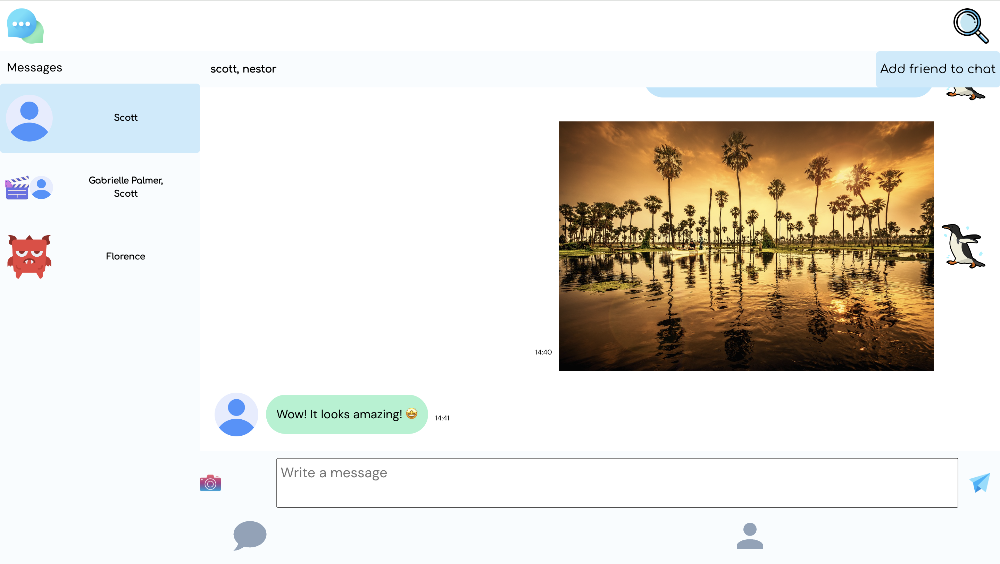

<a id="top"></a>

<div align="center">
    <a href="https://github.com/NestorNebula/messaging-app">
        
    </a>
    
<h3>Messaging App</h3>
</div>

## About



This project is a messaging app where users, once authenticated, can create an account and send messages to other users.

The user can send text messages as well as images and can choose an avatar, write a bio and add a link to the website of his choice.

Users also have the possibility to great group chats with multiple users and to add these users as friends.

### Built With

[](https://nodejs.org/)
[](https://expressjs.com/)
[](https://www.postgresql.org/)
[](https://www.prisma.io/)
[](https://react.dev/)
[](https://vite.dev/)
[](https://vitest.dev/)
[](https://jestjs.io/)

#### AND


[](https://cloudinary.com/)
[](https://www.passportjs.org/)
[](https://jwt.io/)

## Getting Started

### Prerequisites

- NPM
- PostgreSQL database
- Cloudinary Account

### Installation

1. Fork the [Project repository](https://github.com/NestorNebula/messaging-app)
2. Clone the forked repository to your local machine
   ```
   git clone git@github.com:<your username>/<repo name>.git
   ```
3. Update remote URL

   ```
   # SSH:
   git remote add upstream git@github.com:messaging-app/<repo name>.git

   # HTTPS:
   git remote add upstream https://github.com/messaging-app/<repo name>.git
   ```

4. Go to the server directory
   ```
   cd server
   ```
5. Create a .env file with your Cloudinary API keys and the following keys

   ```
   PORT=<PORT>
   DATABASE_URL=<your_db_url>
   AT=<any_key>
   RT=<any_key>
   ORIGIN=<client_url>
   ```

6. Install required packages
   ```
   npm install
   ```
7. Go to the client directory and repeat the same process, this time with this key
   ```
   VITE_API_URL=<your_api_url>
   ```
8. Open the app in development mode
   ```
   npm run dev
   ```

If an error occurs, make sure you have done everything properly according to this guide. If you think so, you can <a href="https://github.com/NestorNebula/messaging-app/issues">Open an Issue</a>.

## Usage

Once the app, the API and the db are running, you should be able to start the app locally.

You can create an account, configure your profile and send messages to other users.

## Contributing

If you find an issue within the app or want to contribute, you can <a href="https://github.com/NestorNebula/messaging-app/issues">Open an Issue</a>.

## License

[](https://github.com/NestorNebula/messaging-app/blob/main/LICENSE)

## Contact

Noa Houssier - [Github](https://github.com/NestorNebula)

## Acknoledgements

- [Material Design Icons](https://pictogrammers.com/library/mdi/)
- [Faker](https://fakerjs.dev/)
- [Supertest](https://github.com/ladjs/supertest)
- [date-fns](https://date-fns.org/)

<p align='right'>(<a href='#top'>go back to the top</a>)</p>
